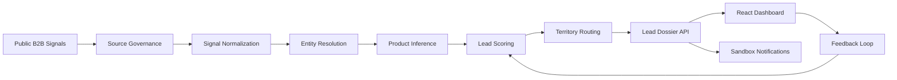

# HPCL B2B Lead Intelligence

> Full-stack B2B sales intelligence prototype that turns public industrial buying signals into explainable HPCL Direct Sales lead dossiers.


## Overview

HPCL Direct Sales teams need to identify industrial customers early: companies publishing tenders, expanding facilities, setting up new plants, increasing logistics activity, or showing procurement intent for fuels and specialty petroleum products.

This project converts those public B2B signals into a sales-ready workflow. It creates structured lead dossiers with company context, source provenance, product fit, confidence, urgency, lead score, territory routing, suggested next action, notification preview, and feedback status.

The project began as a 24-hour IIT Roorkee hackathon/Productathon prototype and has been upgraded into a recruiter-friendly full-stack portfolio project.

## What It Solves

- Finds potential B2B customers from tender/news/company-style signals.
- Infers likely HPCL product needs from industrial context.
- Scores leads by intent, freshness, company size proxy, and location fit.
- Routes leads to regional sales officers.
- Presents explainable dossiers through a FastAPI backend and React dashboard.
- Captures lead feedback such as `NEW`, `ACCEPTED`, `REJECTED`, and `CONVERTED`.
- Keeps data governance visible through source registry and provenance concepts.

## HPCL Product Coverage

| Category | Products |
| --- | --- |
| Industrial fuels | MS, HSD, LDO, FO, LSHS, SKO |
| Specialty products | Hexane, Solvent 1425, Mineral Turpentine Oil, Jute Batch Oil |
| Bulk and direct sales portfolio | Bitumen, Marine Bunker Fuels, Sulphur, Propylene |

## Architecture



## Tech Stack

| Layer | Technology |
| --- | --- |
| Backend API | FastAPI, Pydantic, Uvicorn |
| Intelligence layer | Python heuristic modules for product inference, scoring, routing, entity resolution, and provenance |
| Frontend | React, TypeScript, Vite, lucide-react |
| Data | CSV, YAML, JSON synthetic seed data |
| Testing | pytest |
| DevOps | Docker Compose, GitHub Actions |

## Repository Structure

```text
.
|-- backend/
|   |-- app/main.py              # FastAPI routes
|   |-- app/core/pipeline.py     # Demo pipeline, dossiers, analytics, feedback
|   `-- tests/                   # Backend behavior tests
|-- frontend/
|   |-- src/App.tsx              # Recruiter-facing dashboard UI
|   |-- src/styles.css
|   `-- package.json
|-- src/
|   |-- product_inference/       # HPCL product catalog and recommendation engine
|   |-- lead_scoring/            # Intent, freshness, size, proximity, routing
|   |-- entity_resolution/       # Company normalization and profile builder
|   `-- web_intelligence/        # Source registry and provenance concepts
|-- data/
|   |-- seed/demo_signals_250.csv
|   |-- seed/hpcl_products.yaml
|   |-- seed/source_registry.yaml
|   `-- companies.json
|-- docs/
|   |-- architecture.md
|   |-- data-governance.md
|   |-- demo-script.md
|   |-- deployment.md
|   |-- model-card.md
|   `-- problem-summary.md
|-- scripts/seed_demo_data.py
|-- docker-compose.yml
|-- pyproject.toml
|-- .env.example
|-- .gitignore
`-- .github/workflows/ci.yml
```

## Quick Start

### 1. Clone

```bash
git clone https://github.com/SnehaTanwar006/hpcl-b2b-lead-intelligence.git
cd hpcl-b2b-lead-intelligence
```

### 2. Create And Activate A Python Environment

```bash
python -m venv .venv
```

Windows:

```bash
.venv\Scripts\activate
```

macOS/Linux:

```bash
source .venv/bin/activate
```

### 3. Install Backend Dependencies

```bash
pip install -e .[dev]
```

### 4. Generate Deterministic Demo Data

```bash
python scripts/seed_demo_data.py
```

### 5. Run The Backend API

```bash
uvicorn backend.app.main:app --reload
```

Open:

```text
http://localhost:8000/docs
http://localhost:8000/health
```

### 6. Run The Frontend Dashboard

In a second terminal:

```bash
cd frontend
npm install
npm run dev
```

Open:

```text
http://localhost:5173
```

## Docker Setup

```bash
docker compose up --build
```

Expected services:

- Backend API: `http://localhost:8000`
- Frontend dashboard: `http://localhost:5173`

## API Overview

| Method | Endpoint | Purpose |
| --- | --- | --- |
| `GET` | `/health` | Health check |
| `POST` | `/pipeline/run-demo` | Rebuild demo lead dossiers from seed data |
| `GET` | `/leads` | List generated leads |
| `GET` | `/leads/{lead_id}` | Fetch a complete lead dossier |
| `PATCH` | `/leads/{lead_id}/status` | Update feedback/status note |
| `GET` | `/analytics/summary` | Funnel, priority, product, source, and region metrics |
| `POST` | `/leads/{lead_id}/notifications/preview` | Generate sandbox notification payload |

## Example Lead Dossier

```json
{
  "lead_id": "LEAD-DEMO-0001",
  "status": "NEW",
  "priority": "CRITICAL",
  "company": "National Highways Authority Demo Unit",
  "top_product": "Bitumen",
  "score": "74/90",
  "routing": "West / Ahmedabad",
  "next_best_action": "Call procurement contact and share Bitumen quotation pack within 24 hours."
}
```

## Recruiter Demo Flow

1. Start the backend and frontend.
2. Open the lead queue dashboard.
3. Filter by priority, product, region, source, or status.
4. Select a critical lead.
5. Review the company card, provenance, product recommendation, evidence, score breakdown, and route assignment.
6. Preview the sandbox WhatsApp/email-style alert.
7. Mark the lead as accepted, rejected, or converted.
8. Review updated analytics.

## Testing

```bash
pytest
```

Current backend tests cover:

- Product inference for tender-like bitumen signals.
- Lead feedback/status update behavior.
- Sandbox notification preview behavior.

## Data Governance

This repository uses synthetic demo data by default. A production-grade implementation should:

- Prefer official APIs, RSS feeds, permitted datasets, and lawful public sources.
- Respect robots.txt, website terms, rate limits, and crawl frequency policies.
- Store source URL, timestamp, access method, and trust score for every extracted fact.
- Avoid personal data unless lawful, necessary, documented, and protected.
- Use WhatsApp only for opted-in business notifications with approved templates.
- Keep all API keys and provider tokens in environment variables.

See [docs/data-governance.md](docs/data-governance.md) and [SECURITY.md](SECURITY.md).

## Documentation

- [Problem summary](docs/problem-summary.md)
- [Architecture](docs/architecture.md)
- [Model card](docs/model-card.md)
- [Data governance](docs/data-governance.md)
- [Deployment guide](docs/deployment.md)
- [Demo script](docs/demo-script.md)

## What Was Improved From The Hackathon Prototype

- Reframed the repository with a professional, domain-specific name.
- Replaced the empty README with a complete project explanation and setup guide.
- Added a clean `.gitignore` and removed tracked runtime/cache artifacts.
- Added `.env.example`, `SECURITY.md`, `CONTRIBUTING.md`, and GitHub Actions CI.
- Preserved useful hackathon intelligence modules instead of discarding them.
- Added a FastAPI application layer and structured lead dossier workflow.
- Added a React TypeScript dashboard for reviewing and acting on leads.
- Added deterministic demo data and focused backend tests.
- Added architecture, model-card, governance, deployment, and demo documentation.

## Suggested GitHub Topics

Recommended repository topics for discoverability:

```text
fastapi, react, typescript, b2b-sales, lead-generation, sales-intelligence, hpcl, hackathon-project, data-governance, portfolio-project
```

## Resume Summary

Built a B2B lead intelligence platform for HPCL Direct Sales that ingests public tender/news-style signals, resolves companies, infers likely petroleum product demand, scores urgency, routes opportunities by territory, and presents explainable lead dossiers through a FastAPI API and React dashboard.

## License

This project is available under the [MIT License](LICENSE).
