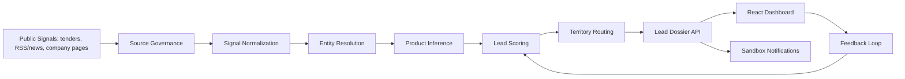

# HPCL B2B Lead Intelligence

> A full-stack B2B sales intelligence prototype that converts public buying signals into explainable, routed, and actionable HPCL Direct Sales lead dossiers.


## Why This Project Exists

HPCL's Direct Sales and Bulk Fuels business serves industrial customers across power, steel, chemicals, fertilizers, shipping, mining, infrastructure, manufacturing, and allied sectors. The business problem is early discovery: finding companies that are expanding, tendering, procuring, or setting up new capacity before a sales opportunity goes cold.

This project turns public web signals into structured lead dossiers for sales teams. It started as a 24-hour IIT Roorkee Productathon hackathon prototype and has been refactored into a professional, recruiter-friendly product repository.

## What It Does

- Discovers B2B lead signals from demo tenders, news/RSS-style updates, company pages, and source registry entries.
- Resolves company identity and builds a target company card.
- Infers likely HPCL Direct Sales product needs.
- Scores each lead using intent, freshness, company size proxy, and geography.
- Routes leads to synthetic regional sales officers.
- Generates explainable lead dossiers with provenance, reason codes, confidence, and next-best-action.
- Previews sandbox WhatsApp/email/Teams-style notifications.
- Captures feedback states: `NEW`, `ACCEPTED`, `REJECTED`, and `CONVERTED`.
- Presents a React dashboard for lead queue review, dossier inspection, and executive metrics.

## Product Families Covered

The inference engine supports the HPCL Direct Sales families described in the problem statement:

| Family | Products |
| --- | --- |
| Industrial Fuels | MS, HSD, LDO, FO, LSHS, SKO |
| Specialty Products | Hexane, Solvent 1425, Mineral Turpentine Oil, Jute Batch Oil |
| Bulk / Other DS Products | Bitumen, Marine Bunker Fuels, Sulphur, Propylene |

## Architecture



## Tech Stack

| Layer | Tools |
| --- | --- |
| Backend API | FastAPI, Pydantic |
| Intelligence Core | Python heuristics for entity resolution, product inference, scoring, routing |
| Frontend | React, TypeScript, Vite, lucide-react |
| Dataset | 250 deterministic synthetic labelled signals |
| Testing | pytest |
| DevOps | Docker Compose, GitHub Actions |

## Repository Structure

```text
backend/
  app/
    main.py                  # FastAPI entrypoint
    core/pipeline.py         # Dossier generation, analytics, feedback, notification preview
  tests/                     # Backend behavior tests
frontend/
  src/                       # React dashboard
data/
  seed/                      # Synthetic labelled data and source/product registries
docs/                        # Architecture, model card, governance, deployment, demo script
scripts/
  seed_demo_data.py          # Regenerates 250-row demo dataset
src/                         # Preserved and refactored hackathon intelligence modules
scrapper/                    # Legacy scraper prototype retained for reference
integration/                 # Legacy integration prototype
```

## Quick Start

### Backend

```bash
python -m venv .venv
.venv\Scripts\activate
pip install -e .[dev]
python scripts/seed_demo_data.py
uvicorn backend.app.main:app --reload
```

Open the API documentation:

```text
http://localhost:8000/docs
```

### Frontend

```bash
cd frontend
npm install
npm run dev
```

Open the dashboard:

```text
http://localhost:5173
```

### Docker Compose

```bash
docker compose up --build
```

## API Overview

| Method | Endpoint | Purpose |
| --- | --- | --- |
| `GET` | `/health` | Service health check |
| `POST` | `/pipeline/run-demo` | Rebuild demo lead dossiers from seed data |
| `GET` | `/leads` | List leads with optional status/priority filters |
| `GET` | `/leads/{lead_id}` | Retrieve one lead dossier |
| `PATCH` | `/leads/{lead_id}/status` | Update feedback status and note |
| `GET` | `/analytics/summary` | Executive funnel/product/region/source metrics |
| `POST` | `/leads/{lead_id}/notifications/preview` | Generate sandbox alert payload |

## Demo Walkthrough

1. Start the backend and frontend.
2. Open the dashboard and filter for Critical priority.
3. Select a highway/tender lead.
4. Review product recommendation, confidence, reason codes, source provenance, lead score, and assigned region.
5. Preview a sandbox WhatsApp-style alert.
6. Mark the lead Accepted or Converted.
7. Review the analytics summary.

## Example Lead Dossier Fields

```json
{
  "lead_id": "LEAD-DEMO-0001",
  "priority": "CRITICAL",
  "company": "National Highways Authority Demo Unit",
  "top_product": "Bitumen",
  "score": "88/90",
  "routing": "West / Ahmedabad",
  "next_best_action": "Call procurement contact and share Bitumen quotation pack within 24 hours."
}
```

## Testing

```bash
pytest
```

The tests cover:

- Product inference for tender signals.
- Feedback/status update loop.
- Sandbox notification policy behavior.

## Data Governance

This project uses synthetic demo data by default. Production ingestion should:

- Prefer official APIs, RSS feeds, and public datasets.
- Respect robots.txt, terms of service, source rate limits, and crawl frequency.
- Store source URL, extraction timestamp, access method, and trust score for every fact.
- Avoid personal data unless lawful, necessary, and documented.
- Use WhatsApp only with opted-in employee recipients and approved templates.

## Documentation

- [Problem Summary](docs/problem-summary.md)
- [Architecture](docs/architecture.md)
- [Model Card](docs/model-card.md)
- [Data Governance](docs/data-governance.md)
- [Deployment](docs/deployment.md)
- [Demo Script](docs/demo-script.md)
- [Security](SECURITY.md)
- [Contributing](CONTRIBUTING.md)

## What Was Improved From The Hackathon Prototype

- Removed runtime artifacts and generated files from Git.
- Added clean dependency management and `.gitignore`.
- Added FastAPI endpoints around the existing intelligence modules.
- Added a dashboard-first React interface.
- Added deterministic labelled demo data.
- Added tests, CI, Docker Compose, and documentation.
- Replaced realistic-looking employee placeholders with clearly synthetic demo contacts.
- Documented model limitations, governance, and deployment approach.

## Future Roadmap

- Add SQLAlchemy persistence with SQLite/PostgreSQL.
- Move legacy scraper code into a clean `ingestion/` package.
- Add scheduled ingestion workers and queue-based processing.
- Add evaluation metrics for Top-1 product accuracy and Top-3 recall.
- Add screenshots and a short demo GIF after deployment.
- Add optional LLM extraction with a strict JSON schema and heuristic fallback.

## Resume-Ready Summary

Built a full-stack B2B lead intelligence system for HPCL Direct Sales that ingests public buying signals, resolves companies, infers likely petroleum product demand, scores urgency, routes leads by territory, generates explainable dossiers, previews compliant sandbox alerts, and visualizes sales pipeline metrics through a React dashboard.
