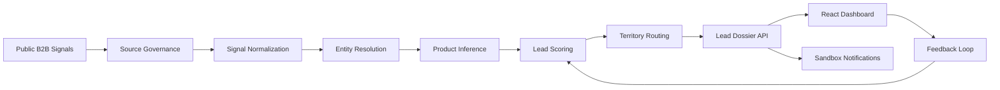

# HPCL B2B Lead Intelligence

> A full-stack B2B sales intelligence prototype that converts public buying signals into explainable, routed, and actionable HPCL Direct Sales lead dossiers.


## Overview

HPCL's Direct Sales and Bulk Fuels business serves industrial customers across sectors such as power, steel, chemicals, fertilizers, shipping, mining, construction, infrastructure, and manufacturing. In B2B industrial sales, the hard part is often early discovery: identifying companies that are expanding, tendering, procuring, or setting up new capacity before the opportunity becomes stale.

This project solves that discovery problem by transforming public B2B signals into structured sales leads. It ingests/demo-processes tender-like updates, news-style expansion signals, and company-page signals, then produces a lead dossier with product fit, confidence, urgency, routing, and next-best-action.

The project began during an IIT Roorkee hackathon/Productathon and has been shaped as a recruiter-friendly full-stack prototype.

## Problem Statement

Build a B2B Lead Intelligence Agent for HPCL Direct Sales that can:

- Monitor public web signals such as tenders, news, company websites, directories, and permitted datasets.
- Identify new customers and expansion/cross-sell opportunities.
- Infer likely HPCL product requirements from industrial context.
- Generate explainable lead dossiers for sales officers.
- Score, prioritize, and route leads by territory.
- Trigger sandbox notifications and capture lead feedback.
- Support executive analytics and a mobile/PWA-style workflow.

## Key Features

- **Source intelligence:** Uses source registry concepts and demo signals to represent public tender/news/company-page inputs.
- **Entity resolution:** Normalizes company identities and creates target company cards.
- **Product inference:** Maps signal text to HPCL Direct Sales product families using keywords, strong indicators, quantities, and operational cues.
- **Lead scoring:** Scores intent, freshness, company size proxy, and geographic proximity.
- **Territory routing:** Assigns leads to regional demo sales officers.
- **Lead dossier API:** Exposes lead details, score breakdowns, product recommendations, provenance, and next-best-action.
- **Feedback loop:** Supports `NEW`, `ACCEPTED`, `REJECTED`, and `CONVERTED` lead states.
- **Notification preview:** Generates sandbox WhatsApp/email/Teams-style alert payloads without contacting external services.
- **Executive dashboard:** React dashboard for lead queue review, dossier inspection, filtering, and pipeline metrics.
- **Demo dataset:** Includes 250 deterministic synthetic labelled signals for repeatable demonstrations.

## HPCL Product Families Covered

| Category | Products |
| --- | --- |
| Industrial Fuels | MS, HSD, LDO, FO, LSHS, SKO |
| Specialty Products | Hexane, Solvent 1425, Mineral Turpentine Oil, Jute Batch Oil |
| Bulk / Other DS Portfolio | Bitumen, Marine Bunker Fuels, Sulphur, Propylene |

## Architecture



## Tech Stack

| Layer | Technology |
| --- | --- |
| Backend API | FastAPI, Pydantic |
| Intelligence Layer | Python heuristic modules for inference, scoring, routing, entity resolution |
| Frontend | React, TypeScript, Vite, lucide-react |
| Data | CSV/YAML/JSON seed data |
| Testing | pytest |
| Deployment Scaffold | Docker Compose |

## Repository Structure

```text
.
├── backend/
│   ├── app/
│   │   ├── main.py              # FastAPI routes
│   │   └── core/pipeline.py     # Demo pipeline, dossiers, feedback, analytics
│   └── tests/                   # Backend behavior tests
├── frontend/
│   └── src/                     # React dashboard
├── src/
│   ├── product_inference/       # HPCL product catalog and recommendation engine
│   ├── lead_scoring/            # Intent, freshness, size, proximity, routing
│   ├── entity_resolution/       # Company normalization/profile builder
│   └── web_intelligence/        # Source registry and provenance concepts
├── data/
│   ├── seed/                    # Demo dataset and product/source registries
│   └── companies.json           # Demo company data
├── docs/                        # Architecture, model card, deployment, governance docs
├── scripts/
│   └── seed_demo_data.py        # Regenerates 250 demo signals
├── integration/                 # Prototype integration layer
├── scrapper/                    # Legacy scraper prototype from hackathon phase
├── docker-compose.yml
└── pyproject.toml
```

## Quick Start

### 1. Clone The Repository

```bash
git clone https://github.com/SnehaTanwar006/IIT_Hack_hpcl.git
cd IIT_Hack_hpcl
```

### 2. Create Python Environment

```bash
python -m venv .venv
```

On Windows:

```bash
.venv\Scripts\activate
```

On macOS/Linux:

```bash
source .venv/bin/activate
```

### 3. Install Backend Dependencies

```bash
pip install -e .[dev]
```

### 4. Regenerate Demo Dataset

The repository already includes seed data, but this command regenerates the deterministic 250-row demo dataset.

```bash
python scripts/seed_demo_data.py
```

### 5. Run Backend API

```bash
uvicorn backend.app.main:app --reload
```

Open the API docs:

```text
http://localhost:8000/docs
```

Health check:

```text
http://localhost:8000/health
```

### 6. Run Frontend Dashboard

Open a second terminal:

```bash
cd frontend
npm install
npm run dev
```

Open the dashboard:

```text
http://localhost:5173
```

## Docker Setup

The project includes a Docker Compose scaffold:

```bash
docker compose up --build
```

Expected services:

- Backend API: `http://localhost:8000`
- Frontend dashboard: `http://localhost:5173`

## API Endpoints

| Method | Endpoint | Description |
| --- | --- | --- |
| `GET` | `/health` | API health check |
| `POST` | `/pipeline/run-demo` | Rebuild demo lead dossiers from seed data |
| `GET` | `/leads` | List generated leads |
| `GET` | `/leads/{lead_id}` | Get one complete lead dossier |
| `PATCH` | `/leads/{lead_id}/status` | Update lead status and feedback note |
| `GET` | `/analytics/summary` | Get funnel, priority, product, source, and region metrics |
| `POST` | `/leads/{lead_id}/notifications/preview` | Generate sandbox alert payload |

## Example Lead Dossier

```json
{
  "lead_id": "LEAD-DEMO-0001",
  "status": "NEW",
  "priority": "CRITICAL",
  "company": "National Highways Authority Demo Unit",
  "top_product": "Bitumen",
  "score": "74/90",
  "routing": "West / Ahmedabad",
  "next_best_action": "Call procurement contact and share Bitumen quotation pack within 24 hours."
}
```

## Testing

Run backend tests:

```bash
pytest
```

Current tests validate:

- Product inference for bitumen tender signals.
- Feedback/status update behavior.
- Sandbox notification preview and policy note.

## Demo Flow For Recruiters

1. Start the backend API.
2. Start the frontend dashboard.
3. Open the lead queue and filter by priority.
4. Select a critical tender lead.
5. Review company card, source, product recommendation, confidence, score breakdown, and routing.
6. Preview the sandbox alert.
7. Mark the lead as accepted or converted.
8. Review updated analytics.

## Data Governance And Safety

This prototype uses synthetic demo data by default. A production version should:

- Prefer official APIs, RSS feeds, and public datasets.
- Respect robots.txt, website terms, and rate limits.
- Store source URL, timestamp, extraction method, and trust score for every extracted fact.
- Avoid personal data unless lawful, necessary, and documented.
- Use WhatsApp only with opt-in and approved business templates.

## Documentation

Additional project documentation is available in the `docs/` folder:

- `docs/problem-summary.md`
- `docs/architecture.md`
- `docs/model-card.md`
- `docs/data-governance.md`
- `docs/deployment.md`
- `docs/demo-script.md`

## Current Status

Implemented:

- FastAPI backend for lead dossiers.
- React dashboard scaffold.
- Product inference engine.
- Lead scoring and routing.
- Feedback status updates.
- Sandbox notification previews.
- Demo dataset generation.
- Tests and Docker scaffold.
- Model card, architecture, deployment, and governance docs.

Recommended cleanup:

- Remove committed `__pycache__` and `.pyc` files from Git.
- Add a `.gitignore`.
- Move legacy `scrapper/` code into a cleaner `ingestion/` package.
- Add screenshots or a short GIF of the dashboard.
- Add a GitHub Actions workflow for tests.

## Suggested Repository Name

A clearer, recruiter-friendly name would be:

```text
hpcl-b2b-lead-intelligence
```

Other good options:

- `hpcl-sales-intelligence-agent`
- `b2b-lead-intelligence-platform`
- `industrial-lead-intelligence-agent`

## Resume-Friendly Summary

Built a full-stack B2B lead intelligence platform for HPCL Direct Sales that transforms public tender/news/company signals into explainable sales lead dossiers using product inference, lead scoring, territory routing, feedback capture, analytics, and a React dashboard.

## 📄 License

This project is licensed under the **MIT License** — see the [LICENSE](LICENSE) file for details.

---

<p align="center">Made with ❤️ by <a href="https://github.com/SnehaTanwar006">Sneha Tanwar</a></p>
