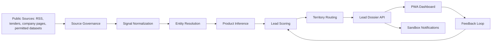

# Architecture

## Backend Components

- `SourceGovernanceService`: stores source type, access method, trust score, crawl rules, and policy notes.
- `IngestionService`: normalizes public signals into a stable internal shape.
- `EntityResolutionService`: resolves company identity and creates target company cards.
- `ProductInferenceService`: maps keywords, operational cues, and quantities to HPCL products.
- `LeadScoringService`: scores intent, freshness, company size proxy, and proximity.
- `RoutingService`: assigns leads to a territory and synthetic demo officer.
- `DossierService`: builds the final lead object for UI/API consumption.
- `FeedbackService`: captures Accepted, Rejected, and Converted statuses.
- `NotificationService`: builds sandbox WhatsApp/email/Teams message previews.

## Current Implementation

The current backend is intentionally demo-first. It uses deterministic seed data and an in-memory repository so recruiters can run the project without external credentials. The next production step is to add SQLAlchemy persistence and scheduled ingestion workers.
