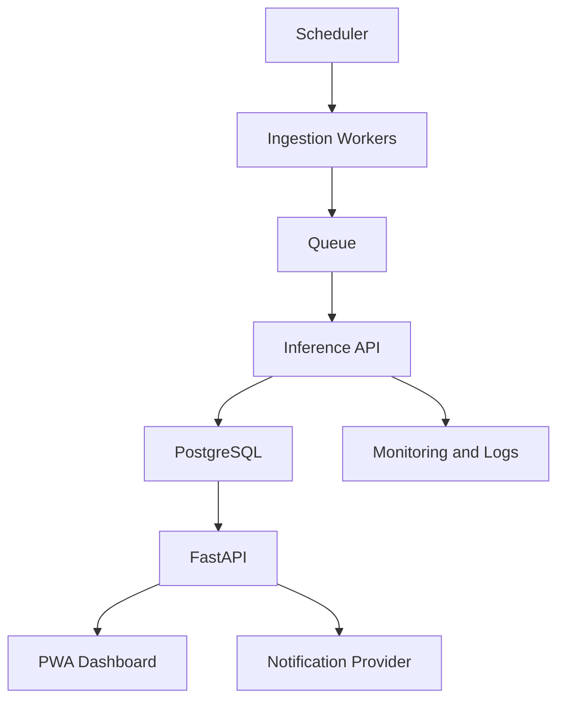

# Deployment

## Local Demo

Use `docker compose up --build` to run:

- FastAPI backend on port 8000.
- React/Vite frontend on port 5173.

## Production-Oriented Architecture

## Suggested Cloud Setup

- API: container service such as AWS ECS, Azure Container Apps, or Render.
- Frontend: static hosting such as Vercel, Netlify, or S3 + CDN.
- Database: managed PostgreSQL.
- Queue: Redis, SQS, or equivalent.
- Monitoring: structured logs, uptime checks, ingestion error alerts.

## Cost Estimate For Demo Scale

- Static frontend: free to low cost.
- Small API container: low monthly cost.
- Small managed PostgreSQL: low monthly cost.
- Scheduled ingestion workers: scale by source frequency.

The recruiter demo can run fully local without paid services.
